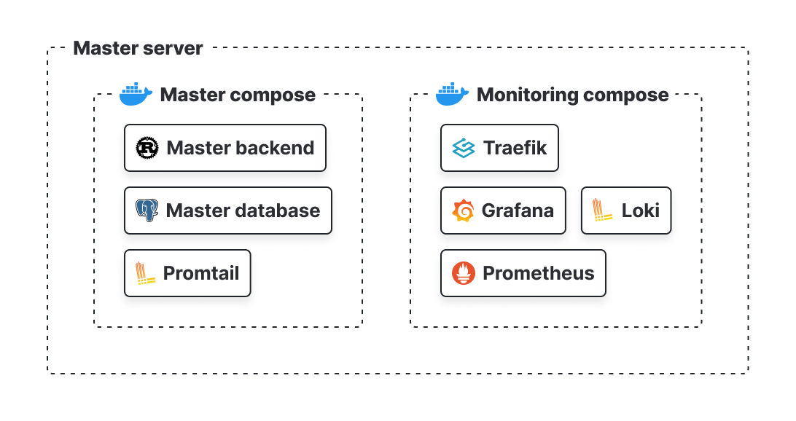

# Helios | Master server

The Master Server is a robust and scalable Rust-based server designed to handle user requests, host a database, and perform various other functions essential for your application's backend operations. It communicates seamlessly with the Agent Server to ensure efficient data management and processing. This project leverages Docker for containerization, enabling easy deployment and management of services.

## Key Features



* **Traefik**: A versatile reverse proxy and load balancer for microservices. Traefik manages the routing of HTTP and HTTPS requests and provides SSL termination using Let's Encrypt.
* **Prometheus**: A powerful monitoring and alerting toolkit used to collect and store metrics from the Master Server and other services.
* **Grafana**: An open-source platform for monitoring and observability. Grafana integrates with Prometheus to visualize metrics and create detailed dashboards.
* **Loki**: A log aggregation system designed to store and query logs from various services.
* **Promtail**: An agent that ships logs from your Docker containers to Loki.
* **PostgreSQL**: A reliable and high-performance relational database system used to store application data.
* **Master Backend**: A Rust-based backend service that processes user requests and interacts with the PostgreSQL database.

## Flow


## Local Development

### Variant 1: Cargo

1. Install Rust and Cargo:

```bash
curl --proto '=https' --tlsv1.2 -sSf https://sh.rustup.rs | sh
. ~/.bashrc
```

2. Clone the repository:

```bash
git clone https://github.com/HeliosShieldProject/master-backend-rust.git
cd master-backend-rust
```

3. Set the environment variables:

```bash
cp .env.example .env
# then edit the .env file with actual values
```

4. Run database:

```bash
docker-compose -f docker-compose-test up -d
```

5. Setup the database:

```bash
curl --proto '=https' --tlsv1.2 -LsSf https://github.com/diesel-rs/diesel/releases/download/v2.2.1/diesel_cli-installer.sh | sh && . ~/.bashrc
diesel setup
diesel migration run
```

> Also seed it with some data or use [psql with this sql](src/tests/e2e/sql/seed.sql)

6. Run the backend:

```bash
cargo run
```

### Variant 2: Docker

1. Clone the repository:

```bash
git clone
cd master-backend-rust
```

2. Set the environment variables:

```bash
cp .env.example .env
# then edit the .env file with actual values
```

3. Run database:

```bash
docker-compose up -d database
```

4. Setup the database:

```bash
curl --proto '=https' --tlsv1.2 -LsSf https://github.com/diesel-rs/diesel/releases/download/v2.2.1/diesel_cli-installer.sh | sh && . ~/.bashrc
diesel setup
diesel migration run
```

> Also seed it with some data or use [psql with this sql](src/tests/e2e/sql/seed.sql)

5. Run the backend:

```bash
docker-compose up -d master-backend
```

## Environment variables

| Variable | Description |
|----------|-------------|
| MASTER_BACKEND_PORT | Port for the backend |
| MASTER_BACKEND_HOST | Host for the backend |
| MASTER_BACKEND_URL | URL for the backend |
| MASTER_METRICS_PORT | Port for the metrics |
| MASTER_METRICS_HOST | Host for the metrics |
| MASTER_METRICS_URL | URL for the metrics |
| DATABASE_PORT | Port for the database |
| DATABASE_NAME | Name of the database |
| DATABASE_USER | User for the database |
| DATABASE_PASSWORD | Password for the database |
| DATABASE_HOST | Host for the database |
| DATABASE_URL | URL for the database |
| JWT_ACCESS_SECRET | Secret for the access token |
| JWT_REFRESH_SECRET | Secret for the refresh token |
| RUST_ENV | Environment for the backend |
| HELIOS_DOMAIN | Domain for Helios |
| DO_AUTH_TOKEN | Token for DigitalOcean |
| TRAEFIK_AUTH | Auth for Traefik |
| GRAFANA_USER | User for Grafana |
| GRAFANA_PASSWORD | Password for Grafana |

> github set secrets:

```bash
gh secret set -f .env
```
